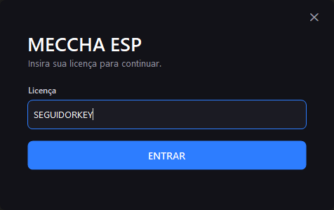
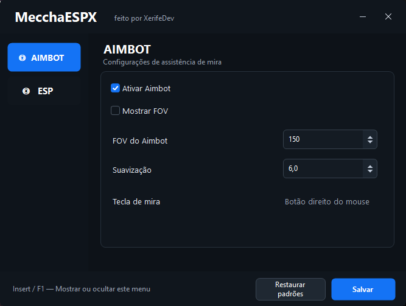
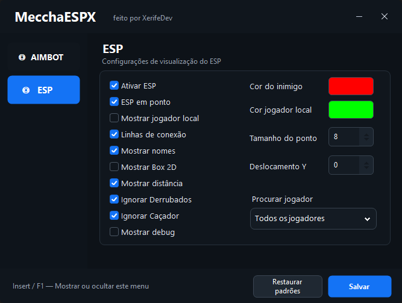

<div align="center">

# ⚡ MECCHA CHAMELEON
# 🎯 ESP & AIM 

### 👁️ ESP • 🎯 AIM • 🔐 SEGUIDORKEY LOGIN

<br>


<br>

### 👑 DEVELOPED BY XERIFEDEV

**Interface moderna • Configuração rápida • ESP & AIM**

<br>

⭐ **Acompanhe o repositório para receber as próximas atualizações**

</div>

---

# 📸 PREVIEW

<div align="center">

## 🔐 LOGIN — SEGUIDORKEY



<br>

**Sistema de autenticação através de licença SeguidorKey**

<br><br>

## 🎯 AIM



<br>

**Configure o AIM diretamente pelo painel**

<br><br>

## 👁️ ESP



<br>

**Visualização e identificação dos jogadores em tempo real**

</div>

---

# 🚀 FEATURES

<table>
<tr>

<td width="50%" valign="top">

## 👁️ ESP

- 👤 Player ESP
- 🏷️ Player Names
- 📏 Distance ESP
- ❤️ Survivor Detection
- 👹 Hunter Detection
- 🔢 Alive / Hunter Counter
- 🔎 Player Filter
- 🚫 Ignore Hunters
- 💤 Ignore Downed Players
- 🎯 Target Highlight
- ❄️ Freeze Detection
- ⚙️ Real-Time Configuration

</td>

<td width="50%" valign="top">

## 🎯 AIM

- 🎯 Aim Assist
- ⭕ Adjustable FOV
- 🧈 Adjustable Smooth
- 👤 Target Selection
- 🔎 Player Filter
- 🚫 Ignore Hunters
- 💤 Ignore Downed Players
- 🎯 Target Indicator
- ⚡ Fast Configuration
- 🖱️ Direct Panel Control

</td>

</tr>
</table>

---

# 🔐 SEGUIDORKEY LOGIN

O acesso ao painel utiliza autenticação através do **SeguidorKey**.

### 🔑 SISTEMA DE LICENÇA

- 🔐 Login através de licença
- ⚡ Validação rápida
- 🔑 Verificação antes da inicialização
- 🛡️ Controle de acesso ao painel
- 🚫 Licenças inválidas são recusadas
- 🔄 Controle de versões

> [!IMPORTANT]
> É necessária uma **licença válida** para acessar o painel.

---

# 📥 DOWNLOAD

<div align="center">

## ⬇️ DOWNLOAD DA ÚLTIMA VERSÃO

### 📦 Baixe sempre através do **GitHub Releases**

<br>

### `Releases → Latest Release → Assets → MecchaESP.exe`

<br>


<br><br>

### ⚠️ UTILIZE SEMPRE A VERSÃO OFICIAL

</div>

> [!IMPORTANT]
> Baixe sempre a versão oficial através das **Releases deste repositório**.
> Não nos responsabilizamos por versões modificadas ou redistribuídas por terceiros.

---

# 🎮 COMO USAR

### 1️⃣ ABRA O JOGO

Inicie normalmente o **MECCHA CHAMELEON**.

### 2️⃣ EXECUTE O PROGRAMA

Abra o executável do **MECCHA ESP & AIM**.

### 3️⃣ FAÇA LOGIN

Digite sua licença no **SeguidorKey** e aguarde a validação.

### 4️⃣ CONFIGURE O AIM

Ajuste as opções desejadas:

```text
🎯 Aim Assist
⭕ FOV
🧈 Smooth
👤 Target
```

### 5️⃣ CONFIGURE O ESP

Escolha as informações que deseja visualizar:

```text
👤 Players
🏷️ Names
📏 Distance
❤️ Survivors
👹 Hunters
```

### 6️⃣ PRONTO

Entre na partida com suas configurações selecionadas.

---

# ⚙️ REQUISITOS

| Requisito | Suporte |
|---|---|
| 🪟 Sistema | Windows 10 / Windows 11 |
| ⚙️ Framework | .NET Framework 4.8.1 |
| 💻 Arquitetura | 64-bit |
| 🎮 Jogo | MECCHA CHAMELEON |
| 🔐 Login | SeguidorKey |
| 🌐 Internet | Necessária para autenticação |

---

# 📦 RELEASES

Todas as versões oficiais serão disponibilizadas através do **GitHub Releases**.

```text
v1.0.0  ── Initial Release
v1.0.1  ── Fixes & Improvements
v1.1.0  ── New Features
```

> [!TIP]
> Utilize sempre a versão mais recente.
> Atualizações do jogo podem exigir uma nova versão do ESP & AIM.

---

# 🔄 ATUALIZAÇÕES

O projeto continuará recebendo melhorias.

### Próximas versões poderão incluir:

- ⚡ Melhorias de desempenho
- 🎯 Melhorias no AIM
- 👁️ Melhorias no ESP
- 🎨 Melhorias na interface
- 🛠️ Correções de bugs
- 🆕 Novas funções
- 🔄 Compatibilidade com novas versões

---

# 🔑 LICENÇA

O programa utiliza autenticação através do **SeguidorKey**.

### ⚠️ IMPORTANTE

- 🔑 Não compartilhe sua licença
- 📸 Não publique sua licença em screenshots
- 🔐 Utilize somente sua própria licença
- 🛠️ Em caso de problemas, utilize os canais oficiais da XerifeDev

---

# ❓ PROBLEMAS?

Antes de reportar algum problema, confira:

```text
✓ Está utilizando a última versão?
✓ MECCHA CHAMELEON está atualizado?
✓ Sua conexão com a internet está funcionando?
✓ Sua licença SeguidorKey está válida?
✓ Já reiniciou o jogo e o programa?
```

---

# ⚠️ DISCLAIMER

Este é um **projeto independente**.

**XerifeDev não possui associação oficial com os desenvolvedores ou publicadores de MECCHA CHAMELEON.**

O usuário é responsável por verificar e respeitar as regras, termos e políticas aplicáveis ao jogo e aos serviços utilizados.

---

<div align="center">

# 👑 XERIFEDEV

## ⚡ MECCHA CHAMELEON
### 🎯 ESP & AIM

<br>


<br><br>

### 🔐 SEGUIDORKEY • 🎯 AIM • 👁️ ESP

### ⚡ DEVELOPED BY XERIFEDEV ⚡

<br>

⭐ **GOSTOU DO PROJETO? DEIXE UMA STAR!** ⭐

</div>
